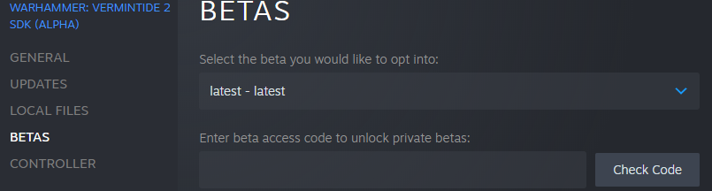
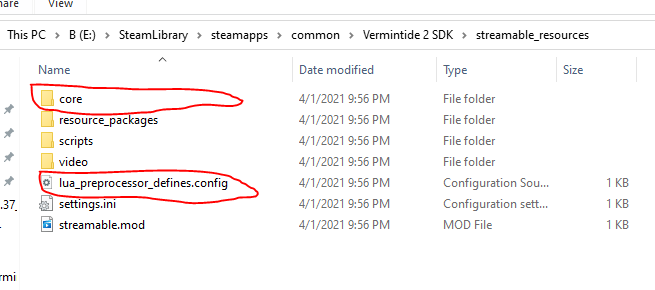
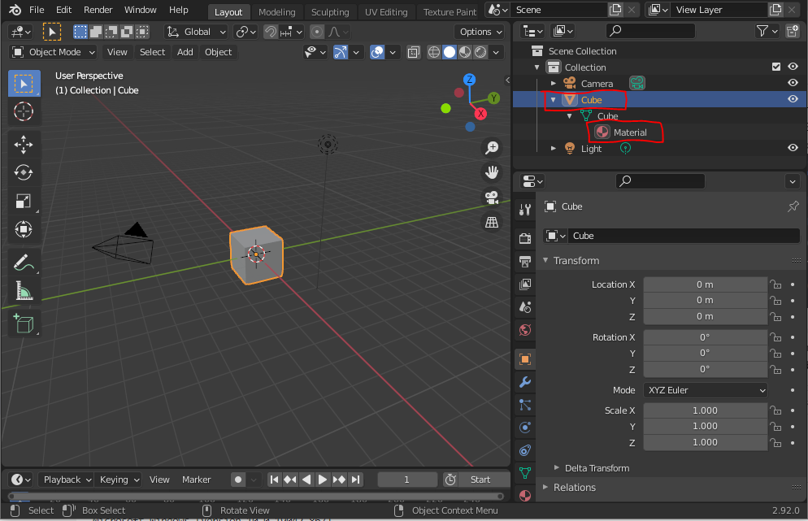

# Example Custom Unit

This documentation would not have been possible without [raindish](https://steamcommunity.com/id/raindish/) paving the way and figuring this all out.

## Preparing Workspace
- In order to compile units and textures you need to be on the latest branch of the verm sdk in steam. Right click on the SDK in steam, select properties, on the window that pops up select betas, and then select latest in the dropdown. 

- Create your new mod as you normally would. Once you create the new mod you will need to move some files over from the SDK. Replace the core file in your mod with the one in the sdk and put the preprocessor config in the root of your mod.


- At this point your mod should fail to build and you will need to remove some files out of the core folder. The files you need to remover are as follow, but it will tell you if you try and build it.
```
stingray_renderer/shader_libraries/gui.shader_source
stingray_renderer/shader_libraries/terrain.shader_source
stingray_renderer/shader_import/no_uvs.material
stingray_renderer/shader_import/no_uvs_transparent.material
```

- Create three new folders in the root of the mod `units`, `materials`, and `textures`

- Add the following lines to your `<mod-name>.package` file
```
unit = [
  "units/*"
]

material = [
  "materials/*"
]  

texture = [
  "textures/*"
] 
```

## Get a model
* Open up blender
* Export the cube model as an .fbx file and save it in the units folder
* Take note of the renderables name and the material name as they will be used in the unit file


## Create Material File 
 - In the material folder you created create a file called `yellow.material`, and paste the following text in it
 ```
parent_material = "core/stingray_renderer/shader_import/standard"
textures = {
}
variables = {
	base_color = {
		type = "vector3"
		value = [
			1
			0.333333333333333
			0
		]
	}
	emissive = {
		type = "vector3"
		value = [
			0
			0
			0
		]
	}
	emissive_intensity = {
		type = "scalar"
		value = 1
	}
	metallic = {
		type = "scalar"
		value = 0
	}
	roughness = {
		type = "scalar"
		value = 0.91
	}
	use_ao_map = {
		type = "scalar"
		value = 0
	}
	use_color_map = {
		type = "scalar"
		value = 0
	}
	use_emissive_map = {
		type = "scalar"
		value = 0
	}
	use_metallic_map = {
		type = "scalar"
		value = 0
	}
	use_normal_map = {
		type = "scalar"
		value = 0
	}
	use_roughness_map = {
		type = "scalar"
		value = 0
	}
}
 ```
- Note: there are many possible options for this, but this is just supposed to be a simple example
## Create Unit File
 - In the units folder, create a file named `<name-of-fbx.unit>`
 - Place the following lines of text in that file note that the material and renderable names are the same as in blender. 
 ```
materials = {
	Material = "materials/yellow"
}
 
renderables = {
	Cube = {
		always_keep = false
		culling = "bounding_volume"
		generate_uv_unwrap = false
		occluder = false
		shadow_caster = true
		surface_queries = false
		viewport_visible = true
	}
}  
 ``` 

## Spawn your model
- Add the following lines of code to you mod 
```lua
local unit_path = "units/Cube"

local function spawn_package_to_player (package_name)
  local player = Managers.player:local_player()
  local world = Managers.world:world("level_world")

  if world and player and player.player_unit then
    local player_unit = player.player_unit

    local position = Unit.local_position(player_unit, 0) + Vector3(0, 0, 1)
    local rotation = Unit.local_rotation(player_unit, 0)
    local unit = World.spawn_unit(world, package_name, position, rotation)

    return unit
  end

  return nil
end

mod:command("testModel", "", function() 
    spawn_package_to_player(unit_path)
end)
```
- Build your mod
- Make sure it is enabled in the launcher
- In game `/testModel` 
- Take a couple steps forward and turn around


- **Note:** Reloading mods while the model is rendered will cause a crash

## Adding Physics

- Create a file named `<name-of-fbx.physics>` in your units folder
- Add the following lines to it
```
actors = [
	{
		enabled = true
		mass = 0
		name = "Cube"
		node = "Cube"
		shapes = [
			{
				material = "default"
				shape = "Cube"
				template = "default"
				type = "mesh"
			}
		]
		template = "static"
	}
]
```
 - Now when you spawn in your unit it will have collision

## Adding Textures
- For this one we are going to add a colormap and normal map.
- In the textures folder create 2 files `wood_basecolor.texture` and `wood_normal.texture` 
- Paste the following lines in both the files
- Change the `filename` in `wood_normal.texture` 
```
common = {
  input = {
    filename = "textures/wood_basecolor"
  }

  output = {
    format = "DXT5"
    apply_processing = true
    enable_cut_alpha_threshold = true
    cut_alpha_threshold = 0.5
    mipmap_filter = "kaiser"
    mipmap_filter_wrap_mode = "mirror"
    mipmap_keep_original = false
    mipmap_num_largest_steps_to_discard = 0
    mipmap_num_smallest_steps_to_discard = 0
    srgb = true
    streamable = true
  }
} 
```
- Copy the png files from my textures folder into yours
- In the material folder, create a new filed named `textured.material`
- Paste this in that file
```
parent_material = "core/stingray_renderer/shader_import/standard"
textures = {
    color_map = "textures/wood_basecolor"
	normal_map = "textures/wood_normal"
}
material_contexts = {
	surface_material = ""
}
variables = {
	base_color = {
		type = "vector3"
		value = [
			0
			0
			0
		]
	}
	emissive = {
		type = "vector3"
		value = [
			0
			0
			0
		]
	}
	emissive_intensity = {
		type = "scalar"
		value = 1
	}
	metallic = {
		type = "scalar"
		value = 0
	}
	roughness = {
		type = "scalar"
		value = 0.8
	}
	use_ao_map = {
		type = "scalar"
		value = 0
	}
	use_color_map = {
		type = "scalar"
		value = 1
	}
	use_emissive_map = {
		type = "scalar"
		value = 0
	}
	use_metallic_map = {
		type = "scalar"
		value = 0
	}
	use_normal_map = {
		type = "scalar"
		value = 1
	}
	use_roughness_map = {
		type = "scalar"
		value = 0
	}
} 
```
- Reading through this you will see this enable the color and normal map
- Change the material in your unit file to use this new textured material `Material = "materials/textured"`
